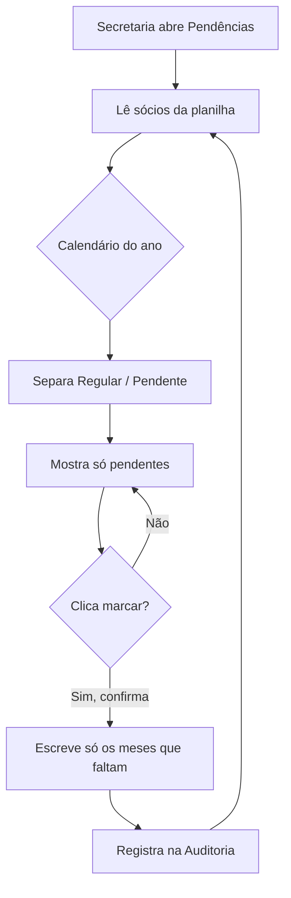
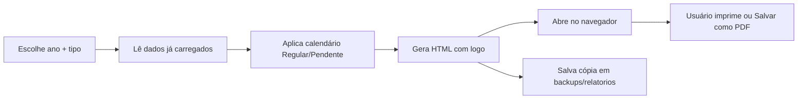
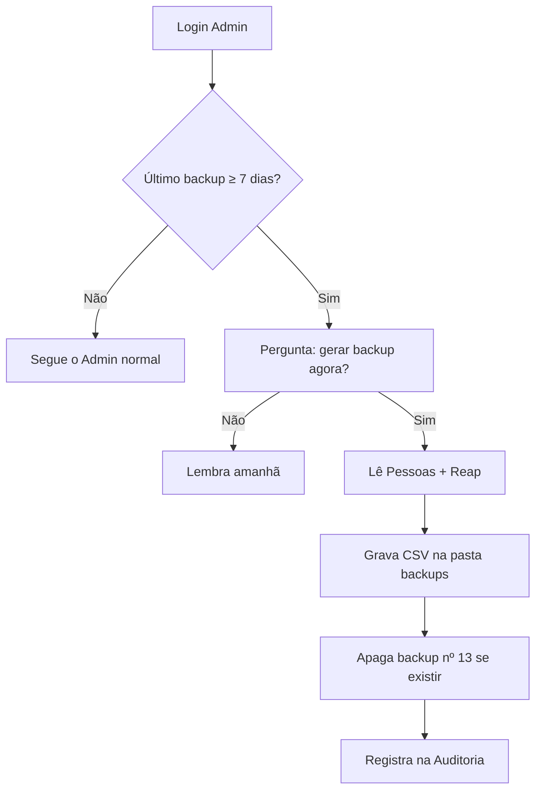
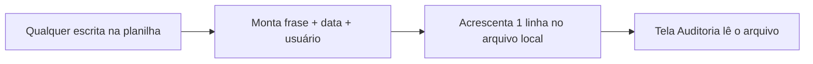
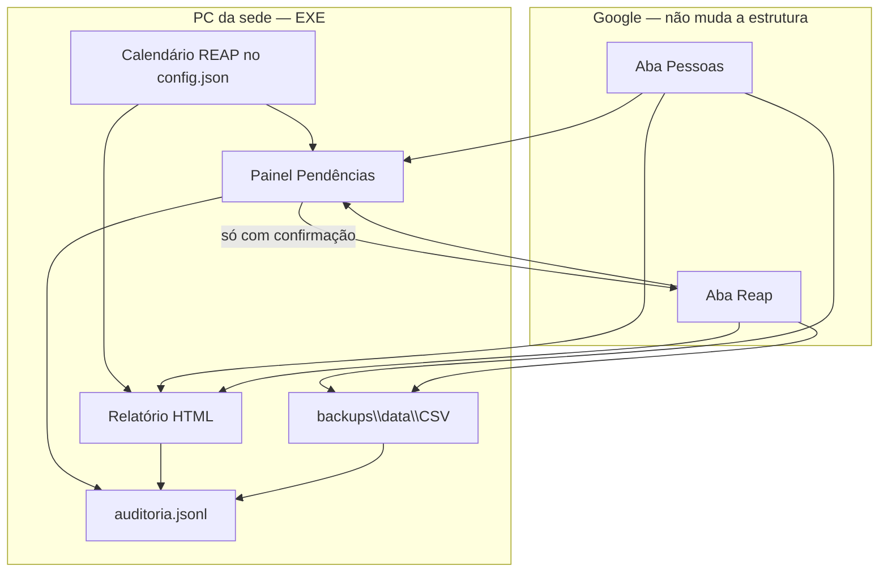

# Plano funcional — v1.6.0

**Status: implementado no código (agosto/2026).** Auditoria ficou **na planilha Google** (não só no PC), para todos os admins monitorarem uns aos outros.

Detalhe de telas e regras originais abaixo. O que mudou na implementação:

- Aba **Auditoria** na mesma planilha (id, em, usuario, acao, detalhe, personId, nome, ano, meses)
- Aba **Config** com o calendário REAP compartilhado
- Relatório HTML (imprimir PDF pelo navegador)
- Backup CSV local + lembrete de 7 dias
- Módulos em `sinapesc-desktop/controle/` e `ui/tela_*.py`

Última revisão: **18/08/2026**

---

## O que o programa já faz (não refazer)

| Já existe | Onde |
|-----------|------|
| Cadastrar sócio (um ou lote) | Admin |
| Marcar mês a mês na ficha | Clique no nome |
| Lote com meses já marcados | Config.Atalhos |
| Marcar meses em massa / copiar ano | Config.Atalhos |
| Consulta por CPF no celular | Site público |
| Planilha Google (Pessoas + Reap) | API |

As quatro funções novas **leem a mesma planilha** e **escrevem só quando você confirmar**. Relatório, backup e log **não dependem da internet** depois que os dados já estão no programa (o backup e o painel precisam ler a planilha uma vez).

---

## Ideia única que liga as quatro

Há um **calendário REAP do ano**: quais meses o sindicato considera obrigatórios.

```
Ano 2026  →  mar abr mai jun jul ago set out     (padrão: safra mar–out)
Ano 2027  →  (você escolhe, ou herda o mesmo)
```

Esse calendário **não grava na planilha Google**. Fica no `config.json` local do EXE, para não misturar regra do sindicato com dado do sócio.

| Função | Como usa o calendário |
|--------|------------------------|
| 1. Pendências | Sócio está pendente se faltar **qualquer** mês obrigatório |
| 3. Relatório | Mostra a grade dos 12 meses + carimbo **Regular** ou **Pendente** |
| 4. Backup | Não usa o calendário (copia a planilha inteira) |
| 7. Auditoria | Registra quando alguém marca meses ou muda o calendário |

Janeiro, fevereiro, novembro e dezembro **continuam existindo** na ficha. Só não entram na conta de “está regular”, se o calendário for mar–out.

---

## Onde cada botão aparece

Tela **Admin** (depois do login), na mesma faixa de hoje:

```
Sócios                              [Pendências] [Relatório] [Backup] [Auditoria]
                                    [Atualizar] [Config.Atalhos] [Cadastro em lote] [+ Novo sócio]
```

- **Pendências / Relatório / Auditoria** = telas novas (login obrigatório).
- **Backup** = não é tela: pergunta “fazer agora?” e abre a pasta no final. Também roda sozinho 1× por semana.

Ninguém da consulta pública vê isso. Site e QR **não mudam**.

---

# 1) Painel “Pendências REAP”

## Para que serve

A secretaria abre **uma lista só de quem falta marcar** no ano, em vez de clicar sócio por sócio.

Exemplo: calendário 2026 = mar–out. Maria tem mar–set marcados e **out** vazio → aparece na lista com “falta OUT”.

## Tela (rascunho)

```
┌─────────────────────────────────────────────────────────────────────────┐
│  Pendências REAP                                              [Voltar]  │
│  Ano [ 2026 ▾ ]   Calendário: MAR → OUT                    [Alterar…]   │
│                                                                         │
│  18 pendentes  ·  42 regulares  ·  60 sócios                            │
│  Buscar [____________________]                                          │
│                                                                         │
│  [Marcar pendentes de todos desta lista]     ← pede confirmação         │
│                                                                         │
│  ┌───────────────────────────────────────────────────────────────────┐  │
│  │ Maria Silva     CPF ***.***.789-**                                │  │
│  │ Falta: OUT                                                        │  │
│  │ mar✓ abr✓ mai✓ jun✓ jul✓ ago✓ set✓ out·                           │  │
│  │                              [Marcar só os pendentes] [Abrir ficha]│  │
│  ├───────────────────────────────────────────────────────────────────┤  │
│  │ João Pesca      CPF ***.***.321-**                                │  │
│  │ Falta: MAR ABR MAI JUN JUL AGO SET OUT   (ano 2026 ainda não criado)│  │
│  │                              [Marcar só os pendentes] [Abrir ficha]│  │
│  └───────────────────────────────────────────────────────────────────┘  │
└─────────────────────────────────────────────────────────────────────────┘
```

## Regras (o que conta como pendente)

1. Olha o **ano escolhido** no topo (padrão = ano atual).
2. Meses obrigatórios = calendário daquele ano.
3. Sócio **pendente** se:
   - não tem linha de REAP naquele ano, **ou**
   - tem a linha, mas algum mês obrigatório está desmarcado.
4. Sócio **regular** se todos os meses obrigatórios estão marcados (os outros meses não importam).
5. A lista **mostra só os pendentes**. Os regulares entram só no contador do topo.

## Botões

| Botão | O que faz | O que **não** faz |
|-------|-----------|-------------------|
| Marcar só os pendentes (uma linha) | Liga **somente os meses que faltam** naquele sócio, naquele ano. Confirma: “Marcar OUT em Maria / 2026?” | Não apaga mês já marcado. Não mexe em outro ano. |
| Marcar pendentes de todos desta lista | Mesma lógica, em lote, só nos que estão na busca. Confirma quantidade. | Não mexe em quem já está regular. |
| Abrir ficha | Volta à lista de sócios com aquele nome aberto | — |
| Alterar calendário | Define mar–out, ano inteiro, ou meses soltos **daquele ano** | Não grava na planilha Google |

Escrita na planilha: **a mesma técnica já usada em Config.Atalhos** (batch, sem marcar mês a mês na API).

## Fluxo



## Casos especiais

| Situação | Comportamento proposto |
|----------|------------------------|
| Sócio novo, sem ano 2026 | Aparece como pendente de **todos** os meses obrigatórios. “Marcar pendentes” **cria** o ano e marca só esses meses. |
| Busca por nome/CPF | Filtra a lista de pendentes (igual à busca de hoje). O botão em massa vale só o que está visível. |
| Calendário vazio (nenhum mês) | Aviso: “Defina os meses obrigatórios”. Não marca nada sozinho. |
| Internet cai na hora de marcar | Mensagem de erro. Nada pela metade: ou grava o lote, ou avisa que falhou. |

---

# 3) Relatório anual de conformidade (HTML → PDF)

## Para que serve

Arquivo da diretoria ou comprovante da **situação REAP** (meses registrados), **sem valor em dinheiro**.

Duas saídas, mesmo visual:

| Tipo | Quem entra | Uso |
|------|------------|-----|
| **Relatório da diretoria** | Todos os sócios do ano | Pasta, reunião, arquivo |
| **Comprovante individual** | Um sócio | Entregar / WhatsApp / imprimir |

Formato: o EXE gera um **HTML** com logo Sinapesc. Você abre no navegador e usa **Imprimir → Salvar como PDF** (todo Windows já tem isso). Não precisa instalar impressora de PDF.

## Cabeçalho (os dois tipos)

```
[logo Sinapesc]
SINAPESC — Sindicato Dos Aquicultores E Pescadores De Casa Nova
Relatório de conformidade REAP  ·  Ano 2026
Calendário considerado: MAR a OUT
Gerado em 18/08/2026 09:41  ·  Uso interno / comprovante de registro
```

## Corpo — diretoria (vários sócios)

Tabela:

| Sócio | CPF | Situação | jan | fev | mar | … | dez |
|-------|-----|----------|-----|-----|-----|---|-----|
| Maria Silva | ***.***.789-** | Regular | · | · | ✓ | … | · |
| João Pesca | ***.***.321-** | Pendente (falta OUT) | · | · | ✓ | … | · |

No rodapé: totais — `60 sócios · 42 regulares · 18 pendentes`.

## Corpo — comprovante individual

```
Nome: Maria Silva
CPF: ***.***.789-**
Ano: 2026
Situação REAP: REGULAR

  JAN  FEV  MAR  ABR  MAI  JUN  JUL  AGO  SET  OUT  NOV  DEZ
   ·    ·    ✓    ✓    ✓    ✓    ✓    ✓    ✓    ✓    ·    ·

Meses obrigatórios deste ano: MAR a OUT — todos registrados.
Este documento não é comprovante de pagamento. É o registro de REAP
constante na base do sindicato na data da emissão.
```

## Como a secretaria gera

Na tela Relatório:

1. Escolhe o **ano**.
2. Escolhe **Diretoria (todos)** ou busca um sócio para comprovante.
3. Clica **Gerar e abrir**.
4. O HTML abre no navegador. Imprimir / Salvar PDF fica a cargo do Windows.
5. Uma cópia do HTML também é salva em `backups/relatorios/` (junto do EXE, se der; senão na pasta de dados do Windows).

## O que **não** entra no relatório

- R$, taxa, “pago”, boleto, recibo financeiro
- Senha, e-mail do admin, chave Google
- CPF completo no **site público** (consulta no celular continua mascarada)
- CPF completo no relatório admin: **sim**, só quem está logado como administrador gera esse HTML

## Fluxo



---

# 4) Backup automático local (CSV)

## Para que serve

Se alguém apagar linha na planilha, ou a conta Google falhar, o sindicato ainda tem **cópia das abas Pessoas e Reap** no computador da sede.

## Quando roda

| Quando | Comportamento |
|--------|----------------|
| **Automático** | Ao entrar no Admin, se o último backup tem **7 dias ou mais** (ou nunca existiu) → avisa e faz. |
| **Manual** | Botão **Backup** na faixa do Admin: “Fazer backup agora?” |

O EXE **precisa estar aberto** e a planilha acessível. Não existe serviço escondido no Windows (não instala nada extra).

## O que é gravado

Pasta (nessa ordem de preferência):

1. `SinapescREAP.exe` → pasta `backups\`
2. Se a pasta do EXE for só-leitura → `%APPDATA%\SinapescREAP\backups\`

Cada backup cria uma **subpasta datada**:

```
backups\
  2026-08-18_0941\
    Pessoas.csv
    Reap.csv
    meta.json          ← data, quantidade de linhas, ID da planilha (não a chave)
```

`Pessoas.csv` = id, nome, cpf, criadoEm  
`Reap.csv` = id, personId, ano, jan … dez, atualizadoEm  

São as **mesmas colunas da planilha**, para dar para reabrir no Excel ou reimportar depois (reimportar automático **não** entra nesta versão — só a cópia).

## Retenção

Guarda os **últimos 12 backups**. O 13º apaga o mais antigo. Assim o disco não cresce para sempre.

## Tela / avisos

- Sucesso: “Backup salvo em …\backups\2026-08-18_0941” + botão **Abrir pasta**.
- Falha (sem internet / API): “Não foi possível copiar a planilha. Tente de novo.” — **não apaga** backup antigo.
- Automático da semana: pergunta uma vez: “Faz 7 dias do último backup. Gerar agora?” — Não = lembra de novo no próximo login (não fica em silêncio para sempre; espera 1 dia para não encher de popup).

## O que o backup **não** faz nesta versão

- Não envia e-mail / Drive / WhatsApp
- Não restaura sozinho na planilha (risco de sobrescrever dado novo)
- Não copia a chave Google nem a senha do admin

## Fluxo



---

# 7) Log de alterações (auditoria)

## Para que serve

Responder: **quem marcou o quê, em quem, a que horas** — sem depender só da coluna `atualizadoEm` da planilha (essa coluna não diz o usuário nem o mês).

## Onde fica

Arquivo **local**, só no PC da sede:

```
%APPDATA%\SinapescREAP\logs\auditoria.jsonl
```

Um evento por linha (fácil de abrir, difícil de corromper). **Não sobe para o Google** (não gasta cota da API e não expõe o log na planilha compartilhada como leitor).

## Quem é “Usuário X”

O e-mail digitado no login admin (hoje: `admin@sinapesc.local`, ou o que estiver em Configurações).  
Se no futuro houver dois logins, o log já separa por esse campo.

## O que é registrado

| Ação da secretaria | Texto que aparece na tela |
|--------------------|---------------------------|
| Marcar/desmarcar um mês na ficha | `admin@… marcou OUT/2026 em Maria Silva` |
| Marcar pendentes (1 ou vários) | `admin@… marcou pendentes 2026 em 18 sócios (calendário mar–out)` |
| Config.Atalhos — massa / copiar ano | `admin@… copiou REAP 2025 → 2026 em 60 sócios` |
| Cadastro (1 ou lote) | `admin@… cadastrou 5 sócios (lote, ano 2026)` |
| Editar nome/CPF | `admin@… editou sócio Maria Silva` |
| Excluir sócio | `admin@… removeu sócio João Pesca e o histórico REAP` |
| Alterar calendário do ano | `admin@… definiu calendário 2026: mar–out` |
| Backup | `admin@… gerou backup 2026-08-18_0941` |
| Relatório | `admin@… gerou relatório diretoria 2026` |

Não registra: digitação na busca, abrir/fechar tela, gerar QR, consulta no site público.

## Tela Auditoria

```
┌─────────────────────────────────────────────────────────────────┐
│  Auditoria                                            [Voltar]  │
│  De [18/07/2026]  até [18/08/2026]   Buscar [Maria____]         │
│                                                                 │
│  18/08 09:41  admin@sinapesc.local                              │
│               marcou OUT/2026 em Maria Silva                    │
│                                                                 │
│  18/08 09:12  admin@sinapesc.local                              │
│               gerou backup 2026-08-18_0912                      │
│                                                                 │
│  17/08 16:02  admin@sinapesc.local                              │
│               cadastrou 5 sócios (lote, ano 2026)               │
│                                                                 │
│  [Exportar CSV desta busca]     só o que está na tela           │
└─────────────────────────────────────────────────────────────────┘
```

Mais recente em cima. Exportar CSV = planilha simples para a diretoria arquivar.

## Retenção e segurança

- Arquivo só cresce no PC da sede (append).
- Se passar de **~5 MB**, o programa fecha o arquivo antigo (`auditoria-2026.jsonl`) e começa um novo. Nada é apagado automaticamente.
- Não tem “editar log” na tela. Apagar o arquivo só é possível pelo Windows Explorer (proposital: auditoria não pode ser reescrita pelo próprio programa).

## Fluxo



Se a escrita na planilha **falhar**, **não** grava log de sucesso.

---

## Como as quatro conversam (visão geral)



A planilha continua com as **mesmas duas abas**. Nenhuma coluna nova. Calendário, backup e log ficam **só no computador**.

---

## O que **não** entra neste pacote (de propósito)

| Fora | Por quê |
|------|---------|
| Valor em R$ / “pago” / boleto | Controle de REAP, não caixa |
| Enviar WhatsApp sozinho | Só comprovante/HTML para a secretaria encaminhar se quiser |
| Restaurar backup na planilha com um clique | Risco de apagar dado mais novo; pode ser v2 depois |
| Dois níveis de senha (secretaria vs consulta) | Sugestão 5, outro pacote |
| Carteirinha com foto | Sugestão 6, outro pacote |
| Mudar o site público | Continua só consulta por CPF |

---

## Ordem de implementação (se você aprovar)

1. **Calendário do ano** no config (invisível sozinho; alimenta o resto)  
2. **Painel Pendências** + botão marcar pendentes (usa API em lote que já existe)  
3. **Auditoria** (gancho em toda escrita; senão o painel nasce sem rastro)  
4. **Backup CSV** semanal + botão  
5. **Relatório HTML** diretoria + comprovante individual  

Assim cada etapa já dá para usar, sem esperar o PDF.

---

## Perguntas para você avaliar

Marque Sim / Não / Mudar. Com isso dá para implementar sem adivinhar.

1. **Calendário padrão** mar–out para todo ano novo — está certo? Ou o padrão deve ser **os 12 meses**?
2. No painel de pendências, **esconder os regulares** (só contador) — ok? Ou prefere uma aba “Regulares”?
3. Relatório: HTML + “imprimir / salvar PDF” do Windows — suficiente? Ou precisa gerar **arquivo .pdf pronto** sem abrir o navegador?
4. Backup: perguntar a cada 7 dias no login — ok? Ou fazer **em silêncio** e só avisar na barra “Backup ok 18/08”?
5. Auditoria: um usuário só (o e-mail do admin de hoje) — suficiente nesta versão?
6. CPF no relatório e na pendência: **sempre mascarado**, igual ao site — ok também no PC da secretaria?

Quando responder, implementamos só o que estiver aprovado, em versão **v1.6.0**, com nota no `CHANGELOG.md`.
